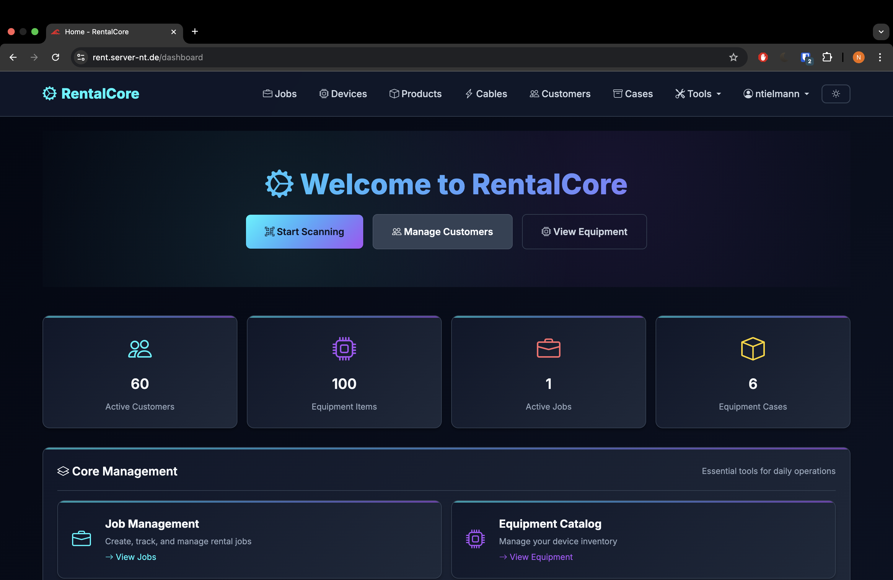
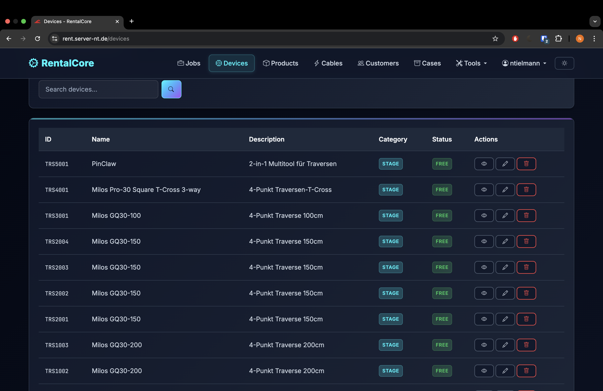
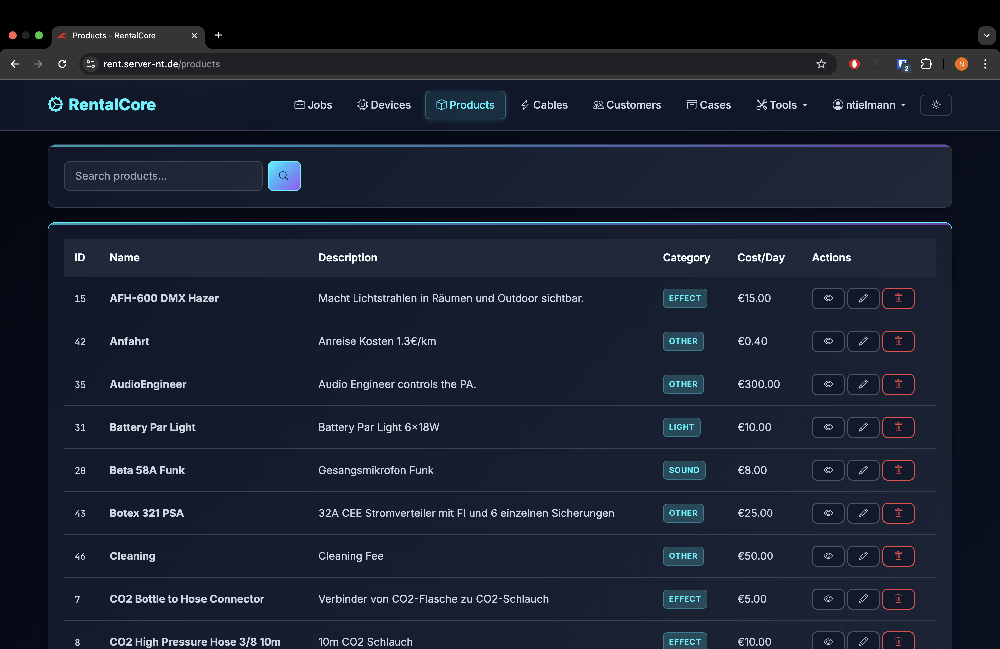
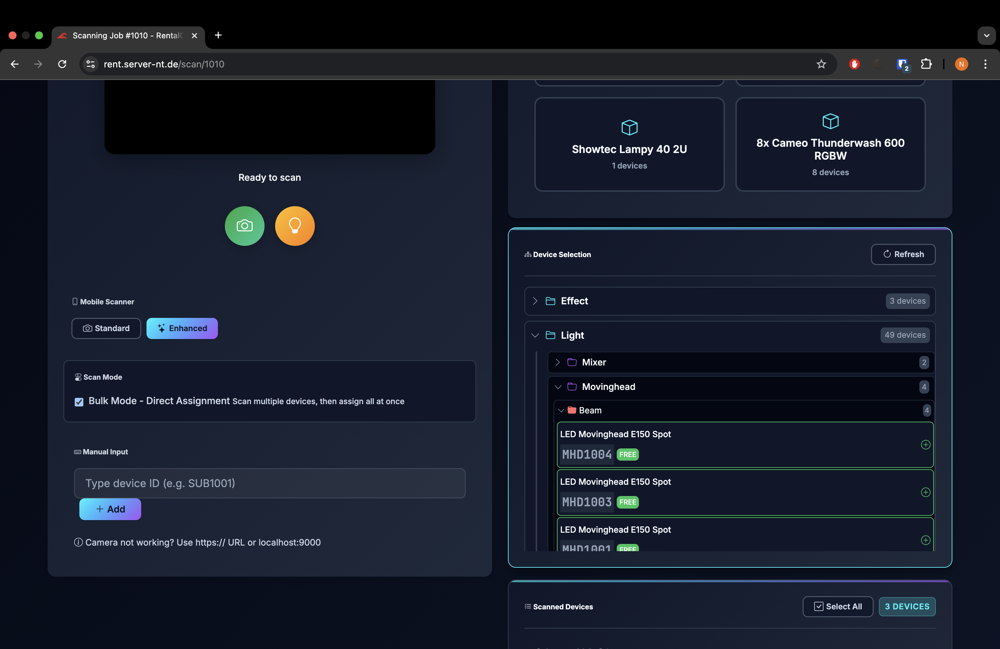
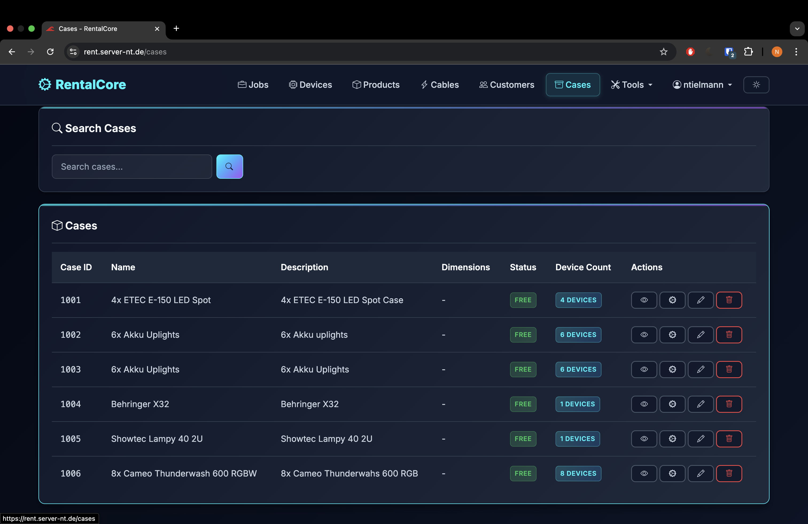
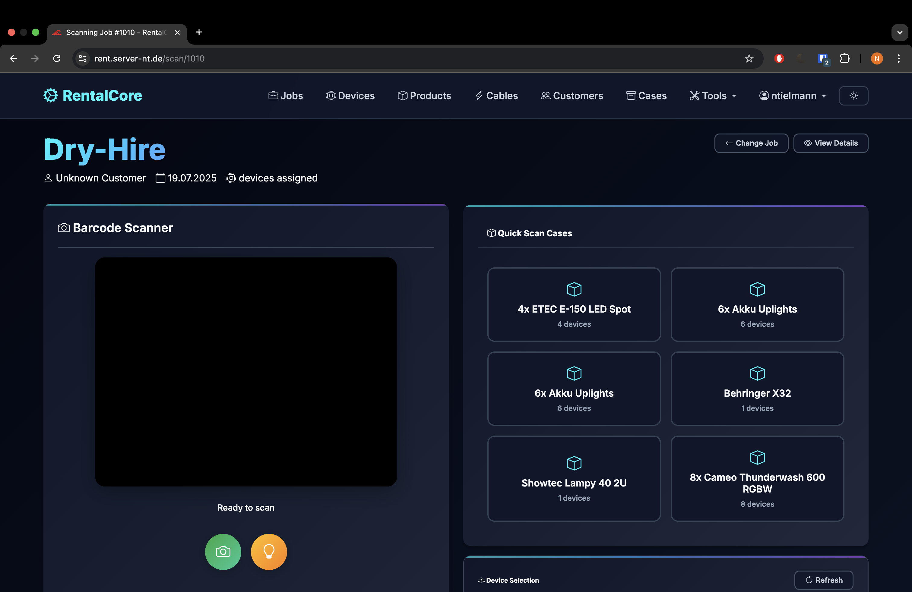

<div align="center">


# 🎯 RentalCore

### Plataforma profesional de gestión y renta de equipos 🚀

<p align="center">
  <b>RentalCore</b> es un sistema empresarial de administración de renta de equipos desarrollado en Go, diseñado para empresas profesionales que requieren analítica avanzada, control de inventario, gestión de clientes y despliegue moderno con Docker.
</p>

<p align="center">
  
  
  
  
  
</p>

<p align="center">
  <a href="#-acerca-del-proyecto">Acerca</a> •
  <a href="#-características">Características</a> •
  <a href="#-tecnologías-utilizadas">Tecnologías</a> •
  <a href="#-instalación">Instalación</a> •
  <a href="#-vista-previa">Vista previa</a>
</p>

</div>

---

# 🌌 Acerca del proyecto

**RentalCore** es una plataforma empresarial de renta y administración de equipos desarrollada para automatizar procesos de alquiler, monitoreo, inventario y análisis financiero desde una interfaz moderna y profesional.

El sistema fue diseñado para empresas que requieren:

- 🎯 Gestión avanzada de equipos
- 📦 Control de inventario
- 👥 Administración de clientes
- 📊 Analítica empresarial
- 📱 Compatibilidad móvil
- 🔐 Seguridad avanzada
- 🧾 Facturación profesional
- 🚀 Infraestructura escalable

Además, la plataforma incorpora tecnologías modernas como WebAssembly, escaneo industrial de códigos de barras y despliegue completo mediante Docker.

---

# ✨ Características

## 📊 Dashboard y analítica avanzada

- 📈 Estadísticas en tiempo real
- 💰 Análisis financiero
- 📉 Métricas de rendimiento
- 📊 Gráficas interactivas
- 📅 Filtros por periodos
- 📄 Exportación PDF y CSV
- 📌 Seguimiento de ingresos

---

## 🏢 Gestión de equipos

- 📦 Inventario completo
- 🏷️ Categorías y productos
- 🔍 Seguimiento de disponibilidad
- 📸 Gestión de dispositivos
- 🧾 Historial de uso
- 📊 Control de mantenimiento
- ⚡ Operaciones masivas

---

## 🔍 Escáner industrial WASM

- 📱 Escaneo de códigos QR
- 📦 Compatibilidad CODE128 y EAN
- ⚡ Procesamiento en tiempo real
- 🚀 Motor Go WebAssembly
- 📷 Integración con cámara nativa
- 🔄 Escaneo continuo
- 🔦 Control de enfoque y zoom

---

## 👥 Gestión de clientes y trabajos

- 👤 Base de datos de clientes
- 📋 Historial de alquileres
- 🧾 Gestión de contratos
- 💵 Facturación automática
- 📦 Asignación de equipos
- 📊 Seguimiento de trabajos
- 📈 Reportes administrativos

---

## 🔐 Seguridad empresarial

- 🔑 Autenticación 2FA
- 🛡️ Roles y permisos
- 🔒 Encriptación AES-256
- 📋 Auditoría completa
- 🌐 Protección HTTPS
- ⚠️ Monitoreo de eventos
- 🧠 Gestión segura de sesiones

---

## 📱 Diseño responsive profesional

- 📲 Mobile First
- 🖥️ Panel adaptativo
- 📋 Tablas responsivas
- 🎨 Tema oscuro moderno
- ⚡ Navegación optimizada
- 👆 Compatibilidad táctil
- 🌍 Progressive Web App

---

# 🛠️ Tecnologías utilizadas

## 🎨 Frontend

<p>
  
</p>

- HTML5
- CSS3
- Bootstrap 5
- JavaScript
- Chart.js
- PWA Support

---

## ⚙️ Backend

<p>
  
</p>

- Go 1.23+
- Gin Framework
- GORM ORM
- REST API
- WebAssembly
- Middleware personalizado

---

## 🗄️ Base de datos

<p>
  
</p>

- MySQL 8+
- Relaciones ORM
- Migraciones automáticas
- Persistencia escalable

---

## 🧰 Herramientas y DevOps

<p>
  
</p>

- Docker
- Docker Compose
- Git
- GitHub
- Visual Studio Code
- Prometheus

---

# 📂 Estructura del proyecto

```bash
PlataformaGestionRentaEquipos/
│
├── cmd/server/               # Punto de entrada
├── internal/
│   ├── handlers/             # Controladores HTTP
│   ├── middleware/           # Middlewares
│   ├── models/               # Modelos ORM
│   └── services/             # Lógica de negocio
│
├── web/
│   ├── templates/            # Interfaces HTML
│   └── static/               # CSS, JS y assets
│
├── migrations/               # Migraciones SQL
├── uploads/                  # Archivos subidos
├── logs/                     # Logs del sistema
├── docker-compose.yml
├── config.json
├── .env
└── README.md
```

---

# ⚡ Instalación

## 📋 Requisitos

- Docker Engine 20+
- Docker Compose
- MySQL / MariaDB
- Go 1.23+
- Linux o Windows
- Certificados SSL (Producción)

---

# 🚀 Configuración del proyecto

## 1️⃣ Clonar repositorio

```bash
git clone https://github.com/isairey/PlataformaGestionRentaEquipos.git
```

---

## 2️⃣ Entrar al proyecto

```bash
cd RentalCore
```

---

## 3️⃣ Configurar variables de entorno

```bash
cp .env.example .env
```

Editar:

```env
DB_HOST=localhost
DB_PORT=3306
DB_NAME=rentalcore
DB_USERNAME=root
DB_PASSWORD=password
```

---

## 4️⃣ Configurar Docker

```bash
cp docker-compose.example.yml docker-compose.yml
```

---

## 5️⃣ Ejecutar contenedores

```bash
docker-compose up -d
```

---

## 6️⃣ Verificar estado

```bash
docker-compose ps
```

---

## 7️⃣ Abrir aplicación

```bash
http://localhost:8080
```

---

# 📊 Funcionalidades principales

## 🎯 Gestión empresarial

- Administración de trabajos
- Gestión de clientes
- Facturación
- Reportes financieros
- Inventario inteligente

---

## 📦 Gestión de inventario

- Equipos y dispositivos
- Códigos QR y barras
- Escaneo industrial
- Seguimiento en tiempo real
- Control de disponibilidad

---

## 📈 Analítica avanzada

- Métricas en vivo
- Dashboard profesional
- Exportación PDF/CSV
- Estadísticas financieras
- Visualización interactiva

---

## 🔐 Seguridad y monitoreo

- Roles de usuario
- 2FA y WebAuthn
- Auditorías
- Logs centralizados
- Protección avanzada

---

# 📸 Vista previa

<div align="center">

### 🔐 Inicio de sesión


### 📊 Dashboard principal


### 📦 Gestión de dispositivos


### 📋 Gestión de productos


### 📱 Escáner profesional


### 📦 Árbol de dispositivos


### 📂 Gestión de cases


### 📈 Vista de trabajos


</div>

---

# 🌐 API REST

## 📡 Endpoints principales

### 📊 Analytics API

```bash
GET /analytics
GET /analytics/export
GET /analytics/devices/:id
```

---

### 📦 Equipos y dispositivos

```bash
GET /api/v1/devices
POST /api/v1/devices
PUT /api/v1/devices/:id
DELETE /api/v1/devices/:id
```

---

### 👥 Clientes

```bash
GET /api/v1/customers
POST /api/v1/customers
```

---

### 📋 Trabajos

```bash
GET /api/v1/jobs
POST /api/v1/jobs
```

---

# 🔍 Arquitectura del escáner WASM

## ⚡ Go WebAssembly

- Procesamiento industrial
- Decodificación rápida
- Web Workers
- ROI inteligente
- Escaneo continuo
- Compatibilidad móvil

---

## 📦 Formatos soportados

| Tipo | Compatibilidad |
|------|----------------|
| CODE128 | ✅ |
| CODE39 | ✅ |
| EAN-13 | ✅ |
| EAN-8 | ✅ |
| QR Code | ✅ |
| UPC-A/E | ✅ |

---

# 📱 Diseño responsive

## 🎨 Sistema adaptativo

- 📲 Navegación móvil
- 🖥️ Sidebar escritorio
- 📋 Tablas inteligentes
- 📏 Tipografía fluida
- ⚡ Optimización táctil
- 🌍 Compatibilidad total

---

# 🚀 Despliegue profesional

## 🐳 Docker Deployment

```bash
docker pull rentalcore/latest
```

---

## 🌐 Reverse Proxy

Compatible con:

- Nginx
- Traefik
- Apache
- Cloudflare

---

## 📊 Monitoreo

- Prometheus
- Logs estructurados
- Health checks
- Métricas del sistema

---

# 🧠 Objetivos del proyecto

## 🎯 Aprendizaje y desarrollo

- Arquitectura empresarial
- Sistemas escalables
- Go Backend
- DevOps
- Docker
- Seguridad avanzada
- APIs REST
- WebAssembly

---

# 🚧 Roadmap

## 🔮 Próximas mejoras

- 🤖 Inteligencia artificial
- ☁️ Kubernetes
- 📱 Aplicación móvil
- 🌍 Multi idioma
- 🔔 Notificaciones en tiempo real
- 📊 IA analítica predictiva
- 💳 Pasarelas de pago

---

# 🤝 Contribuciones

Las contribuciones son bienvenidas ❤️

## Cómo contribuir

1. Fork del proyecto

```bash
git checkout -b feature/nueva-funcionalidad
```

2. Commit

```bash
git commit -m "✨ Nueva funcionalidad"
```

3. Push

```bash
git push origin feature/nueva-funcionalidad
```

4. Pull Request 🚀

---

# 👨‍💻 Desarrollador

<div align="center">

## Isai Reyes — Full Stack Developer

Desarrollador apasionado por sistemas empresariales, arquitecturas escalables y plataformas modernas 🚀

</div>

---

# 🌟 Apoya el proyecto

⭐ Dale una estrella  
🍴 Haz fork  
📢 Comparte el proyecto

---

# 📜 Licencia

Proyecto open source bajo licencia MIT orientado a sistemas empresariales y despliegues profesionales.

---

<div align="center">

### 🎯 RentalCore — administración profesional de renta de equipos 🚀

</div>
